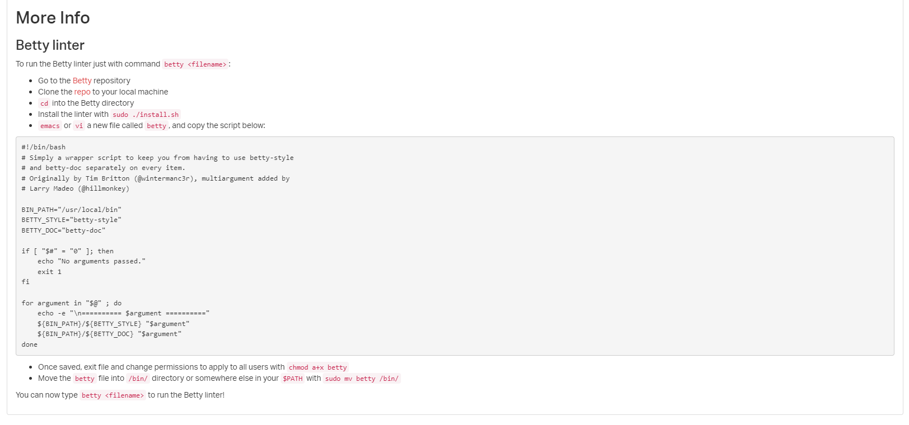

# C PROGRAMMING

</a href=https://alx-intranet.hbtn.io/rltoken/P01aLj9BDfDUOv-y9x82Yw>
    <h2>For information on getting started with C</h2>
</a>

# Getting started with Betty linter

<h2>
    You can access the <a href=https://github.com/holbertonschool/Betty>Repo Betty from here</a>
</h2>

<h2><a href=https://github.com/osala-eng/alx-low_level_programming/tree/master/0x00-hello_world>0x00 Hello world</a></h2>
